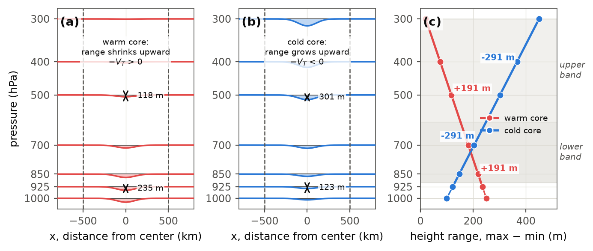
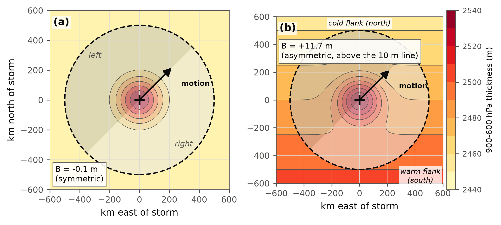
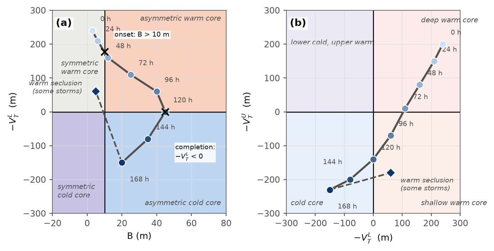

# Cyclone Phase Space in D2D: User Guide

For forecasters. This guide covers what the CPS products show, how to
load them, how to read them, and where they mislead. It assumes nothing
about how they are computed; that is in the Technical Guide.

**Status: experimental.** Checked against a typhoon, its extratropical
transition timing against the FSU cyclone phase page, and a cold-core
North Atlantic low; three GFS cases from one model cycle, a smoke
test, not yet through a full season. See the README's validation log
for what was and was not recorded from each case, and the acceptance
criteria for moving past "experimental".

---

## 1. What it is

Cyclone Phase Space (Hart 2003) classifies a cyclone by its thermal
structure rather than by intensity or track. The FSU web page draws the
result as a trajectory through a diagram, one dot per forecast hour, for
each tracked storm. These D2D products compute the same numbers at
every grid point of a model and show them as maps, so every low in the
domain gets classified on every frame, with no tracker and no advisory
required. What you lose is the trajectory picture; what you gain is
every low at once, on every model in D2D, including ones nobody is
issuing advisories on.

The three numbers behind every product here are explained in plain
language in section 2. In short:

- **Lower thermal wind, -VTL.** Whether the storm's core is warmer
  or colder than its surroundings in the lower troposphere (925 to 700
  hPa). Positive is warm.
- **Upper thermal wind, -VTU.** The same for the upper troposphere
  (500 to 300 hPa). Positive is warm.
- **B, the frontal asymmetry.** Whether warm and cold air sit on
  opposite sides of the storm's motion. Computed as HB, and combined
  with both thermal wind terms into HCPSclass, the joint
  classification (see sections 3 and 5).

HB relies on the model's own deep-layer steering wind standing in for
the storm's motion, so it is worth cross-checking by eye too: overlay
1000 to 850 hPa thickness and look for closed contours around the low
(symmetric) or a tight gradient across it (frontal).

---

## 2. How the three terms work

Everything else in this guide is a way of reading three numbers off a
map. This section explains what those numbers mean before you look at
the products in section 3.

### The lower and upper thermal wind: is the core warm or cold?

Picture a cross-section through a storm. The height of a pressure
surface dips down over the low, like a shallow bowl. How that bowl
changes shape as you go up in the atmosphere is what tells you whether
the storm is warm-core or cold-core.

In a hurricane, the whole column of air above the storm is warm, and
warm air is less dense, so the dip is deepest right at the surface and
fills in quickly with height: by 300 hPa there is not much of a low
left. In a cold-core low the column is cold and dense, so it is the
other way around: the dip is shallow at the surface but gets deeper
with height, and the strongest low sits aloft rather than at the
ground.

Hart turns that shape into a number. At each level, measure the height
range inside a circle around the center, the highest point inside minus
the lowest. Then look at how that range changes with height. Shrinking
upward means warm core, and the number comes out positive. Growing
upward means cold core, and the number comes out negative.

Because a storm's structure can differ between the lower and upper
troposphere, Hart computes this twice: once for a lower band of levels
and once for an upper band. HVTL is the lower number (Hart's -VTL),
HVTU is the upper number (Hart's -VTU). A hurricane is warm all the way up, so both
read positive. A subtropical storm or a warm seclusion is warm only
near the surface, so the lower number is positive while the upper
number is near zero or negative. That split between the two levels is
exactly what HCPSclass's class and HCPSidx's index are built from.

### Parameter B: is the storm sitting in a front?

The two thermal wind numbers describe the storm's own core. B describes
what is going on around it.

Thickness, the depth of the layer between two pressure levels, is a
stand-in for how warm that layer of air is: a thick layer is warm, a
thin one is cold. Take the same circle around the storm, split it into
a side to the right of the storm's direction of travel and a side to
the left, and compare the average thickness on each side.

For a hurricane sitting in a uniform tropical air mass, the two sides
look about the same, so B comes out near zero: the storm is symmetric.
Once a storm moves into a baroclinic zone, warm air collects on one
side and cold air on the other, and B grows. B is relative to the
storm's motion, not to the compass: it is the side to the right of the
track (in the Northern Hemisphere) versus the side to the left, so a
large negative B means warm air to the left of the motion, not that
the storm is symmetric. Hart's threshold for calling that asymmetry
significant is 10 meters. HB reproduces this idea from a gridded
approximation, standing in the deep-layer steering wind (the 850 to
300 hPa mean), horizontally averaged over the same window used for the
thermal wind terms, for a tracked heading. Averaging the wind over the
window before taking its direction is what cancels a developed storm's
own circulation and leaves the environmental flow; it is why HB should
not be trusted blindly for a storm that is barely moving (steering
under 2 m/s leaves HB blank) or moving against its own steering flow
(see section 7). HB is also a full field, computed everywhere the
inputs allow, not only at detected lows: away from a low it is just
the ambient thickness gradient across the flow at that point, which
says nothing about a storm, so a large HB reading away from a low is
not itself a finding, and a large HB of either sign anywhere is worth
a look at the thickness field.

### The two diagrams and the transition sequence

Hart plots these three numbers on two diagrams: B against the lower
thermal wind, which separates symmetric from frontal and warm from
cold; and lower against upper thermal wind, which separates deep warm
core, shallow warm core, and cold core. A hurricane starts in the deep
warm, symmetric corner of both.

As a storm undergoes extratropical transition it moves through these
diagrams in a set order: B climbs past 10 meters and the storm becomes
frontal first (HCPSclass moves from 0 to 2, the Evans and Hart onset),
then the upper warm core is usually lost next (HCPSclass moves from 2
to 3), and finally the lower thermal wind turns negative (HCPSclass
reaches 4, the Evans and Hart completion). Some storms then curve back
toward the warm side as a warm seclusion re-forms a shallow warm core
near the surface (HCPSclass back to 1, with the upper term still
cold), which is one reason those systems can deepen unexpectedly over
cold water. Section 6 walks through spotting this sequence on shift.

*A warm core's height perturbation weakens with height, giving a positive slope; a cold core's grows, giving a negative slope: that slope is HVTL and HVTU.*

*B compares the average thickness on the two sides of the storm's track; a hurricane in a uniform air mass reads near zero, a storm in a front reads well above 10 meters.*

*A transitioning storm traces a path through both diagrams: B crosses 10 meters, the upper warm core is lost, then the lower one, sometimes hooking back toward a warm seclusion.*

### Why one number

Hart's two diagrams are two projections of one three-dimensional space
(B, lower thermal wind, upper thermal wind) that happen to share the
lower thermal wind axis. Each diagram alone carries one piece of
information the other lacks: the B-versus-lower diagram says whether
the storm is frontal, the lower-versus-upper diagram says whether a
warm core is deep or shallow. That joint space has eight cells (B
symmetric or frontal, times lower warm or cold, times upper warm or
cold); HCPSclass gives seven codes because code 6 merges the two cells
where the lower term is cold and the upper term is warm, symmetric and
frontal alike, into a single code. Operationally that
means sampling one number at the low center instead of reading two
panels and combining them by eye, and the resulting codes fall in
order along the transition (see "Reading the class" in section 5).
HCPSclass is a summary field, not an event detector: an event needs
history to detect, and a single frame can only say what state the
storm is in right now. Onset and completion are read from HB and HVTL
directly, not from HCPSclass (see "Reading the class" in section 5 and
section 6).

### How this differs from the FSU page

HCPSclass and the FSU page describe the same three numbers, but not the
same measurement. The FSU page follows one tracked storm along its
path; HCPSclass classifies every closed low on the grid, every frame,
independent of any track. The FSU page draws a trajectory through the
diagram; HCPSclass gives you a map per forecast hour, and you recover
the trajectory by animating and reading the class at the low center (or
by sampling HVTL, HVTU, and HB there directly). The FSU page uses
Hart's own 500 km circle and true half-circle motion; this package uses
the 500 km window (a square of 500 km half-width, 1000 km across)
rather than a circle, because a square
runs fast enough to compute at every grid point on every frame (section
7 has the trade-off), and the deep-layer steering wind averaged over
that window in place of a tracked heading, so HB and HCPSclass are
unreliable for a storm moving against its own steering flow or one
that is nearly stationary (steering under 2 m/s leaves HB, and so
HCPSclass, blank). Both are memoryless at any single time; both
read onset and completion from watching the trajectory change, not from
one frame. And HCPSclass classifies any closed low that clears its
depth test (about 5 hPa for a compact low, more for a broad flat one;
section 7), tropical or not, tracked or not, which is the point of
building it as a gridded product at all.

---

## 3. The products

| Product | Menu name | What it shows | Read as |
| :--- | :--- | :--- | :--- |
| HCPSclass | Hart CPS Class (0 sym deep warm, 1 sym shallow warm, 2 frontal deep warm, 3 frontal shallow warm, 4 frontal cold, 5 sym cold, 6 shallow cold) | one of seven classes (0-6), the intersection of the quadrants of Hart's two diagrams, at each detected low, blank elsewhere | see "Reading the class" in section 5 |
| HVTL | Hart CPS -VTL 925-700 (m) | lower thermal wind, meters | positive warm core, negative cold core |
| HVTU | Hart CPS -VTU 500-300 (m) | upper thermal wind, meters | positive warm core, negative cold core |
| HB | Hart CPS B 900-600 equiv (m) | thermal asymmetry, meters (900-600 hPa equivalent) | at or below 10 symmetric, above 10 frontal |
| HCPSidx | Hart CPS Index -3 to +3 | one number from -3 to +3 at each detected low | -3 deep cold, 0 neutral, +3 deep warm |

All products sit at a single Surface plane in the Product Browser and
overlay on anything.

---

## 4. Loading

**Product Browser.** Grid, then the model, then the product name, then
Surface. The five Hart products appear together because their names
start with Hart CPS. If a product is missing for a model, check which
inputs that model lacks: HVTL and HVTU need their three height levels
(925/850/700 or 500/400/300) plus surface pressure; HCPSclass and
HCPSidx also need 1000 hPa height; HCPSclass and HB also need wind at
850, 700, 500, and 300 hPa and the coriolis field. That is seven
height levels in all, not six.

**Volume Browser.** Only if your site has added the entries to the
Fields menu; then they are under a Hart CPS heading.

**Saved procedure.** The recommended way. Someone at the site has saved
a four-panel with the colormaps and ranges set. Load it from the
procedures list or from the site menu item if one was added.

**Recommended four-panel.** One model, one cycle, one frame at a time,
MSLP contours in every panel, then:

1. HCPSclass as image, with 1000 to 850 hPa thickness contours and
   10 m wind speed contours at 34, 48, and 64 kt.
2. HVTL as image, with 850 hPa temperature contours.
3. HVTU as image, with 500 hPa height contours.
4. HB as image, with 1000 to 850 hPa thickness contours.

HCPSidx is a useful optional fifth panel, for a smoother trend line
than the class alone. Where a scatterometer or satellite pass is
available for the same time, use it as an independent check on the
four panels, not as a replacement for reading them.

**Colormaps.** If a panel comes up in the default green ramp, right
click the legend, Change Colormap, Grid, and pick CPS_CoreDiverging for
HVTL, HVTU, HB, and HCPSidx; or CPS_HartClass for HCPSclass. The
diverging map is transparent near zero on purpose so the contours show
through.

**Sampling.** Left click and hold reads the value under the cursor.
HVTL, HVTU, and HB read in meters, HCPSclass reads the class code,
HCPSidx reads the index.

---

## 5. Reading the fields

### Reading the class, HCPSclass

Hart's strict lines: B against 10 m, and both thermal wind terms
against 0, warm if greater than or equal to zero and cold if less
than zero. There is no neutral band here (compare HCPSidx below, which
keeps one).

The colors form three groups so onset and completion read as abrupt
shifts: reds for a symmetric warm core (0 red, 1 magenta), yellow and
green for a storm in transition (2 yellow once B passes 10 m, 3 green
once the upper warm core is lost), blues for a cold core (4 blue once
HVTL turns negative, 5 indigo once symmetric). Gray (6) is the rare
shallow cold core.

| Code | Color | Name | B | lower VT | upper VT | Typical system |
| :--- | :--- | :--- | :--- | :--- | :--- | :--- |
| 0 | red | symmetric deep warm core | <= 10 | warm | warm | hurricane, typhoon |
| 1 | magenta | symmetric shallow warm core | <= 10 | warm | cold | subtropical storm, or warm seclusion after transition |
| 2 | yellow | frontal deep warm core | > 10 | warm | warm | hurricane meeting a trough, transition beginning |
| 3 | green | frontal shallow warm core | > 10 | warm | cold | transition under way |
| 4 | blue | frontal cold core | > 10 | cold | cold (code 6 takes lower cold, upper warm first) | extratropical low, transition complete |
| 5 | indigo | symmetric cold core | <= 10 | cold | cold (code 6 takes lower cold, upper warm first) | occluded or cutoff cold low |
| 6 | gray | shallow cold core (lower cold, upper warm) | any | cold | warm | perturbation peaking at mid-levels; rarely occupied |
| blank | | not a closed low, or B undefined | | | | no closed low, or steering below 2 m/s |

Ties go to the warm side and the symmetric side: B exactly at 10 m
counts as symmetric, and either thermal wind term exactly at 0 counts
as warm. The seven codes are the eight cells of B (symmetric/frontal)
times lower and upper thermal wind (warm/cold), with code 6 merging
the symmetric and frontal versions of "lower cold, upper warm" into
one code.

The codes rise along a typical extratropical transition: 0, 2, 3, 4. A
warm seclusion typically runs 4 to 3, or 4 to 1 if B also falls at or
below 10 m; watch HVTL crossing back above 0, not which code color is
on screen, since that crossing is the actual signature. Onset and
completion are events, and HCPSclass is a summary of them, not the
place to detect them: onset is the first frame HB crosses above 10 m,
and completion is the first frame HVTL crosses below 0 (both read from
HB and HVTL directly; see section 6). Read both from the
animation, never from a single frame; the field has no memory of the
frame before it.

A blob appears only where the model has a closed low that clears the
depth test (roughly 5 hPa for a compact low; section 7 has the exact
rule and its exceptions). The blob is a square about 400 km across
around the center, and its pixels are not one class from edge to edge;
never read the blob's color as the answer. Always sample the class at
the MSLP center. Open ocean stays blank. Very weak lows get no blob;
that is deliberate. A storm sitting exactly
on a strict line (B at 10 m, or a thermal wind term at 0) can flip
between adjacent codes frame to frame; that is expected near a
boundary, and HVTL, HVTU, and HB are smoother places to look for the
underlying trend when it happens.

### The numbers, HVTL and HVTU

These are Hart's own quantities in his units. Typical values:

| System | HVTL | HVTU | HB |
| :--- | :--- | :--- | :--- |
| mature hurricane or typhoon | +100 to +300 | +50 to +300 | near 0 |
| subtropical or sheared storm | positive | near zero or negative | rising toward 10 |
| storm undergoing extratropical transition | mixed, falling | usually negative first | above 10 |
| deep extratropical or post-transition low | negative | -100 to -300 | well above 10 |
| weak or marginal system | within about 25 of zero | | |

Zero is the warm versus cold boundary, exactly as on the FSU diagram.
Values are close to but not identical to the FSU page for the same
storm, because the FSU page uses 50 hPa levels and these use standard
levels only. In practice the lower term reads higher than the FSU
page for a shallow warm core (a seclusion or a storm in transition),
because the 925 to 700 hPa band sits lower than Hart's 900 to 600 hPa
layer; a synthetic test put the overstatement at 60 to 80 m for those
profiles and showed that a deeper band would lose the signal instead.
With about 5 m of height noise the terms at a center scatter by about
15 m (HVTL) and 9 m (HVTU) and B by under 1 m, so expect the class to
flicker when a term is within about 15 m of zero or B within a meter
of 10 m; the continuous fields show the trend through such a stretch.

The raw HVTL, HVTU, and HB images paint a square about 1000 km across
around each low; that is the shape of the 500 km window, not a
feature of the storm, and
its pixels are not one value from edge to edge. See section 7 for why
the window is a square. Always sample the value at the MSLP center,
never read the blob's color or footprint. Within a few hundred
kilometers of Greenland or Iceland, a level whose window is mostly
below ground goes blank (NaN) rather than being fit through sparse
data, so HVTL, HVTU, and HCPSclass can go blank there even over open
water nearby; that is deliberate, not missing data.

### The index, HCPSidx

One number for glanceability and trends. Near +3 deep warm, +1 to +2
shallow warm, near 0 neutral, negative cold. It blurs the shallow warm
versus cold distinction that the class keeps, so use it for trends and
the class for the call.

---

## 6. Using it on shift

**Extratropical transition timing.** Step through the frames on a
tropical cyclone headed into higher latitudes and watch HB and HVTL,
not the class color; HCPSclass is a convenient summary of where those
two fields stand, not the event itself.

1. **Onset.** The first frame HB crosses above 10 m is the Evans and
   Hart (2003) objective onset: the storm has picked up a frontal
   asymmetry while at least the lower core is still warm. HCPSclass
   moving from 0 to 2 or 3 in the same frame is the usual signature,
   but read HB itself, since a class jump can lag or lead it by a
   frame near a strict line.
2. **Loss of the upper warm core.** HVTU going negative while the
   storm is still frontal (HCPSclass moving from 2 to 3) is a sign
   transition is under way, not itself one of the two named Evans and
   Hart markers.
3. **Completion.** The first frame HVTL crosses below 0 is the Evans
   and Hart (2003) completion time: the lower warm core is gone.
   HCPSclass reaching 4 or 5 in the same frame is the usual signature.

Read HB and HVTL from the animation, stepping several frames back and
forth, not from one frame in isolation; the fields have no memory, so
a single frame cannot tell you whether a crossing is the start of a
trend or a one-frame flicker on a strict line. A storm can also jump
straight from class 0 to class 4 in one frame if the HB and HVTL
crossings land in the same forecast hour; that is both crossings
happening close together, not a detector failure.

Keep the thickness overlay as a cross-check: the low moving from
closed 1000 to 850 hPa thickness contours into a tight gradient across
it should line up with the frame HB crosses 10 m, and a mismatch is
worth a second look before trusting either field alone. Around these
hours the wind field expands well beyond its tropical radius and
becomes strongly asymmetric, and the gale and storm-force radii grow
fastest.

**Caution on HB and HCPSclass.** HB is computed from the deep-layer
steering wind (850, 700, 500, and 300 hPa), averaged over the 500 km
window before its direction is taken, standing in for the storm's own
motion, not a tracked heading. It is unreliable or blank for a storm
moving against its own steering flow or one that is nearly stationary
(steering under 2 m/s), and HCPSclass's frontal/symmetric split
inherits that weakness wherever HB is unreliable or blank. HB is also
a full field away from any low; a large reading there is the ambient
environment, not a storm, so cross-check a large |HB| of either sign
against the thickness field before trusting it. See section 7 for more.

**Model comparison.** Load HB and HVTL for two models on the same
storm and step frames side by side (HCPSclass makes the same
comparison easier to eyeball, but is the summary, not the source).
Compare the hour each model's HB first crosses 10 m (onset) and the
hour each model's HVTL first crosses 0 (completion); where they
disagree is the transition uncertainty, and that is usually the wind
forecast uncertainty as well. Compare crossing hours and trends rather
than magnitudes between models: a synthetic test found grid spacing
itself changes the terms by under 2 percent between 0.25 and 1 degree
for storm-scale features, so a magnitude difference between models is
mostly a real difference in the forecast structure, but the bands and
window make every magnitude an approximation of Hart's, and the
crossings are what the classification rests on.

**Weak-low fallback.** If a system is too weak to clear the closed-low
test, HCPSclass and HCPSidx are blank there, but HVTL and HVTU still
show a number under the cursor. Do not read that number as the
storm's: at a rejected low sitting on a baroclinic zone, the 500 km
window is dominated by the zone, not by the weak wave, and the value
describes the zone's thermal structure, not the storm you were trying
to check. Only read HVTL/HVTU as the storm's own numbers at a point
that passes the closed-low test.

**Warm seclusion.** Class 1 alone does not separate a warm seclusion
from a subtropical storm; both read symmetric, warm lower core, cold
upper core. The storm's history is what tells them apart: a
high-latitude low that reached class 4 (or close to it) and then
returns to class 1, typically by way of 4 to 3 and then 4 to 1 if B
also falls at or below 10 m, has re-formed a warm core near the
surface after an extratropical phase. Watch HVTL crossing back above
0, not the code color, and confirm with closed 1000 to 850 hPa
thickness contours around the low. These are the systems that
unexpectedly deepen and produce hurricane-force winds over cold water.

**Subtropical storms.** A subtropical storm tends to sit marginal on
all three of Hart's thresholds at once (B near 10 m, HVTL near 0,
HVTU near 0), so small analysis differences move it between adjacent
codes readily; that is expected borderline behavior on this kind of
system, not noise to be filtered out.

**Handoff and hybrid cases.** HVTL, HVTU, and HCPSidx behave the same
way on a hybrid or post-tropical system as on any other closed low;
what is least tested on exactly these systems is the frontal half of
HCPSclass (codes 2 through 5), since a subtropical or hybrid system
sits closest to the strict lines that split them. A system reading 2
or 3, frontal with a still-warm lower core, is the classic subtropical
or hybrid case. Whether it trends toward 0 (rare) or on toward 4 over
the next 24 h says which way the handoff goes; weigh the class call
itself more cautiously than the raw HVTL/HVTU numbers here. Onset and
completion, as named events, mean something only for a storm of
tropical origin working through extratropical transition; for a low
that was never tropical, a class 4 to 5 transition (or the reverse) is
ordinary occlusion, not an Evans and Hart event.

**Read the trend, not the frame.** One frame jumping a class, or one
frame crossing a strict line in HB or HVTL, is noise on its own. Two
or three consecutive frames in the same direction is signal.

### What it does not tell you

HCPSclass, HCPSidx, HVTL, HVTU, and HB describe thermal structure and
motion-relative asymmetry only. None of them is an intensity forecast,
a wind speed forecast, or a wind radii forecast: a class 0 low can be
a weak subtropical depression or a major hurricane, and nothing here
distinguishes them. Use them alongside MSLP, wind, and satellite or
scatterometer data, never as a stand-in for any of those.

---

## 7. Cautions

- **It classifies the model's storm.** A confident-looking class on a
  bad model track is a confident wrong answer. Compare models.
- **The 500 km window is a square, by design.** HVTL, HVTU, and HB are
  computed over the 500 km window (a square of 500 km half-width,
  1000 km across), not a circle, because a square sliding max/min runs
  fast enough to compute at every grid point on every frame; a
  circular filter would cost several times more per frame for a bias
  this package's tests found small on an isolated storm. The trade-off
  is an extra, direction-dependent share of the background gradient.
  Be aware that the background gradient itself, which Hart's method
  also includes, lowers both terms for any storm in a baroclinic zone:
  in a synthetic test a moderate jet-entrance environment took a deep
  warm core's upper term from +191 m to about zero. Some of the upper
  warm core loss you see as a typhoon enters the westerlies is the
  environment, not only the storm; that is how Hart's diagnostic
  behaves too, and it is why his transition thresholds were set with
  the environment included.
- **HB depends on the steering flow, not the storm's real motion.**
  HB and HCPSclass stand in the deep-layer wind (850, 700, 500, and
  300 hPa), averaged over the 500 km window before its direction is
  taken, for the storm's own heading. Averaging over the window first
  is what cancels a developed storm's own circulation and leaves the
  environmental flow; a storm moving against its own steering flow, or
  a nearly stationary one (steering under 2 m/s), gets an unreliable
  or blank HB, and HCPSclass's frontal/symmetric call inherits that
  weakness wherever HB is unreliable or blank. Cross-check against the
  thickness overlay before calling onset or completion from HB or
  HCPSclass alone.
- **HB is a full field, not masked to lows.** Away from a detected
  low, HB is just the ambient thickness gradient across the flow at
  that point and says nothing about a storm; under this package's
  first-order method a symmetric vortex contributes nothing to B at
  all, so a large |HB| of either sign, on or off a low, is a cue to
  check the thickness field, not a finding on its own.
- **Blank over high terrain, and near it too.** Greenland, the
  Rockies, and other high ground are blank because the lower levels
  are below the surface there. Within a few hundred kilometers of
  Greenland or Iceland, HVTL, HVTU, and HCPSclass can also go blank
  over nearby open water, because a level's window there is mostly
  over that masked terrain and is dropped rather than fit through
  sparse data. Both are correct behavior, not missing data.
- **Weak lows and broad lows are not classified.** The closed-low test
  is about 40 m (roughly 5 hPa) of height rise between the center and
  the square 300 to 500 km ring around it; a compact 300 km low clears
  it around 6 hPa deep, but a broad, flat low needs more than 5 hPa of
  true depth to clear the same test and can go unclassified. The
  numbers still exist in HVTL, HVTU, and HB if you need them, but see
  the weak-low fallback caution in section 6 before reading them off a
  rejected low. An elongated trough with a strong gradient across it
  can occasionally pass the test at a point that is not really a
  closed low's center, producing a spurious blob; check MSLP before
  trusting an isolated one.
- **Neighboring lows share windows.** Two lows within about 1000 km of
  each other have overlapping 500 km windows, and the display dilation
  can merge their two blobs into one. Check MSLP for a second low
  inside a blob's footprint before reading it as a single system.
- **Near-strict-line flicker.** A storm sitting on one of HCPSclass's
  strict lines (B at 10 m, or a thermal wind term at 0) can flip
  between adjacent codes from one frame to the next. The class has no
  neutral band by design, so this is expected near a boundary. HVTL,
  HVTU, HB, and HCPSidx are smoother places to look for the underlying
  trend through a flickering stretch.
- **Values near a coast.** Within about 500 km of high terrain the
  window has less data on one side. The value is still valid but less
  robust.

---

## 8. Quick reference

- Load: Product Browser, Grid, model, Hart CPS products, Surface. Or the
  saved procedure.
- Colors: CPS_CoreDiverging for HVTL, HVTU, HB, and HCPSidx;
  CPS_HartClass for the class.
- Read: class at the MSLP center, never the blob's color or footprint.
  0 symmetric deep warm, 1 symmetric shallow warm, 2 frontal deep warm,
  3 frontal shallow warm, 4 frontal cold, 5 symmetric cold, 6 shallow
  cold core (rare), blank not a closed low.
- Numbers: positive warm, negative cold, zero is the line for HVTL and
  HVTU; B at or below 10 m is symmetric, above 10 m frontal; HVTL, HVTU,
  and HB read in meters, HCPSidx is a dimensionless -3 to +3 index.
- Onset and completion: read from HB and HVTL, not from HCPSclass.
  Onset is HB crossing above 10 m; completion is HVTL crossing below 0.
  HCPSclass's usual signature is 0 to 2 or 3 for onset, then 4 or 5 for
  completion, but it is the summary, not the detector. A warm
  seclusion typically runs 4 to 3, or 4 to 1 if B also falls at or
  below 10 m. Read both crossings from the animation, and cross-check
  against 1000 to 850 hPa thickness.
- The 500 km window (a square of 500 km half-width, 1000 km across) is
  why the raw fields paint a square footprint; the fast square filter
  is the trade-off documented in section 7.
- Always overlay MSLP and thickness; never compare HB or HVTL
  magnitudes between models or resolutions, only crossing hours and
  trends.
